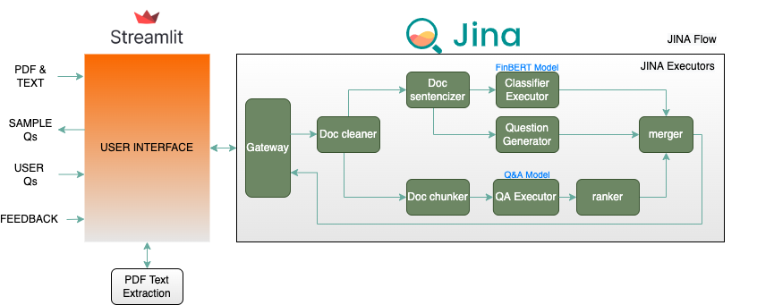
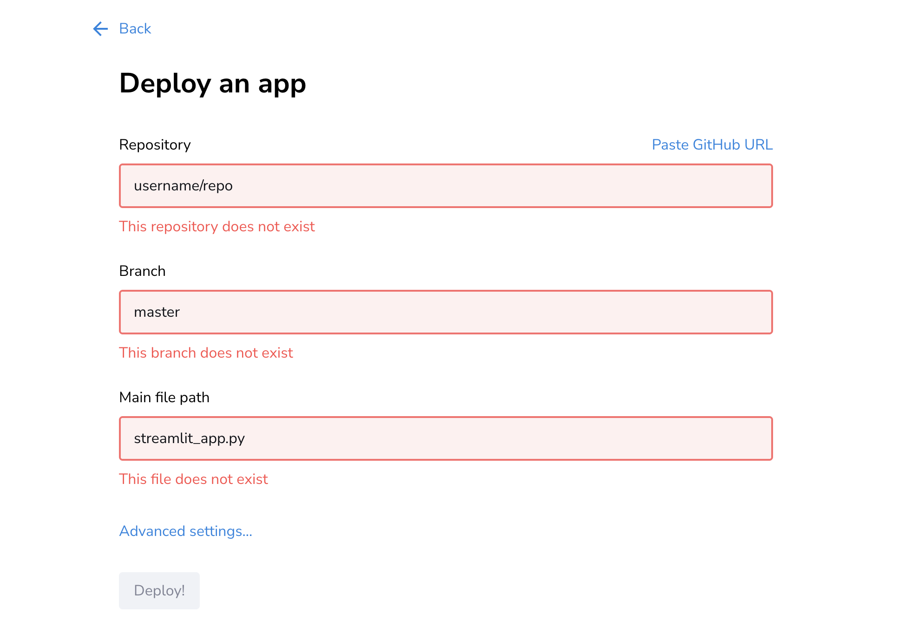

# Project -Question and Answering using Semantic Search & Sentiment analysis

# Overview

## Scope of Work

The main scope of this project is to create an application with an interface to text or pdf, and questions as input and then provide matching sentences in the information provided, and sentiment of the text as output.

It uses a semantic search mechanism where the search accuracy is improved by understanding the content and context of the search query. It also features a query generator that can analyze the document and suggest potentially relevant queries.

## High-level Architecture & Components Involved



# Approach to Implementation (Technology and Design Choices)

### Scope

- Financial Domain(Annual Reports, Business Reports etc)

Technology Choices

- UI Development -  Streamlit
- Backend Server - JINA Cloud
    - JINA FLOW as Orchestrator
    - JINA Executors for application components
    - Document Array for storing the Document
- Model
    - [Finetuned BERT: qa_financial_v2](https://huggingface.co/anablasi/qa_financial_v2) - Pretrained Financial QA Model (Huggingface pipeline)
    - [FinBERT](https://huggingface.co/ProsusAI/finbert) - Pretrained Financial Classification Model (Huggingface pipeline)
    - [doc2query](https://github.com/jina-ai/executor-doc2query) - Pretrained T5 model that generates queries (JinaHub)
- Pre-commit: isort, black, autoflake, flake8, shellcheck, mypy, pytest
- CI/CD -GitHub Actions
- Deployment (2 options)
    - Docker-based Deployment
    - Streamlit App UI + JINA CLOUD

## Implementation Steps

- Jina Flows
    - Decomposing the data pipeline into isolated “Executor” units.
    - Using tags to filter data stream through Flow.

# Local Installation

## **Dev Instructions**

### **Install [Poetry](https://python-poetry.org/docs/)**

e.g.:

`curl -SSL https://install.python-poetry.org | python3 -
export PATH="${PATH}":"${HOME}"/.local/bin`

Clone repo

`git clone git@github.com:navant/FSDL-2022-Semantic-Search-QA.git
cd FSDL-2022-Semantic-Search-QA`

### **Install deps**

`poetry install`

### **VS Code Integration (Optional)**

`poetry shell  # This activates the virtual environment of the project making it available to VS Code
code .`

Then, in VS Code, choose the interpreter and kernel from the virtual environment.

### **Linting**

Main considerations:

- 120 chars per line (setup your editor for that)
- FSDL chose google style over pep8 (we can change it if we want to)

Adopted linting strategy from FSDL Course adding isort and autoflake for dealing with imports.

If you want to run linting before commit, stage files and then run:

`./project_tasks/lint.sh`

NOTE: If at some point some of the linting errors slows down our goal (e.g. typing with mypy or docstring) we can decide to relax the rules.

### **Local Inference App Launch**

We use streamlit so...

`streamlit run src/semantic_search_qa/ui/01_main.py`

To run the server part we use [Jina](https://docs.jina.ai/), so...

`jina flow -v --uses src/semantic_search_qa/server/server.yml`

It is best to run each of these commands in a separate terminal so that you can see the outputs of both.

Then check it out here: [http://localhost:8501/](http://localhost:8501/)

## **Dockerized Inference App Launch**

`docker build -t semantic_search_qa .
docker run -it --rm -p8501:8501 -p54321:54321 semantic_search_qa`

Then go to [http://localhost:8501](http://localhost:8501/) and just press the "Fire!" button under the default text/question provided. You will receive the responses below and a form to optionally provide feedback about the accuracy of the received responses.

## **Jina**

### **Notes**

- v3.8.0 doesn't show dependency problems
- If an error similar to `...may have been in progress in another thread when fork() was called` shows in your Mac, do `export OBJC_DISABLE_INITIALIZE_FORK_SAFETY=YES`

# Server Deployment

The Packages can be independently deployed in UI and Backend layer.

## UI Layer

Front End UI Deployment steps into Streamlit by Signup and login into [https://streamlit.io/](https://streamlit.io/) and pointing to the [main.py](https://github.com/navant/FSDL-2022-Semantic-Search-QA/blob/main/src/semantic_search_qa/ui/01_main.py)  of the GitHub repository



<aside>
💡 Note:  File updates in the Git Repository will be automatically refreshed into Streamlit app

</aside>

## Backend Layer

Backend server-side components are deployed in [JINA Cloud](https://docs.jina.ai/fundamentals/jcloud/index.html). JINA Cloud provides simple CLI to manage the lifecycle of your Jina projects.

Every executor has to be packaged separately and linked into a flow file.

### Initial Steps

Install the jcloud on the client where you want to deploy

```python
pip install jcloud
jc -h
```

### Login

You can use a Google/GitHub account to register and login. For all the next steps, logging in is mandatory.

```python
jc login
```

### D**eploy**

In Jina, a project is a [Flow](https://docs.jina.ai/fundamentals/flow/), which represents an end-to-end task such as indexing, searching or recommending.

<aside>
💡 **Caution:** Flows have a maximal lifetime after which they are automatically deleted.

</aside>

A Flow can have two types of file structure: a single YAML file or a project folder.

### **A single YAML file**

A self-contained YAML file, consisting of all configs at the [Flow](https://docs.jina.ai/fundamentals/flow/)-level and [Executor](https://docs.jina.ai/fundamentals/executor/)-level.

e.g.-

*`# flow.yml* **type**: Flow
**executors**:
  - **name**: sentencizer
    **uses**: jinahub+docker://Sentencizer`

To deploy with Debugging, Local the Flow YAML file in our case its server.yml and issue the following command from the PROJECT_HOME Directory

```python
jc --loglevel DEBUG deploy /src/semantic_search_qa/server/server.yml
```

Please note down the Flow ID and Dashboard ID after successful deployment which will be like below

Example:


You will get a Flow ID, say `173503c192`. This ID is required to manage, view logs and remove the Flow.

As this Flow is deployed with the default gRPC gateway (feel free to change it to `http` or `websocket`), you can use `jina.Client` to access it:

**`from** jina **import** Client, Document

c = Client(host='https://173503c192.wolf.jina.ai')
**print**(c.post('/', Document(text='hello')))`

### Monitoring

Flows can be monitored via Dashboards that are provided by Jina Cloud which can be accessed via

[https://dashboard.wolf.jina.ai/d/flow/flow-monitor?var-flow=c724f56b46](https://dashboard.wolf.jina.ai/d/flow/flow-monitor?var-flow=c724f56b46)

Sample Dashboard


### **List Flows**

To list all the Flows you have:

```python
jc list --status ALL
```

# Findings and Learnings

- PDF processing
    - Chunking text for QA vs ‘Sentencizing’ for Classification.

- Deployment
    - Docker-based deployment was unsuccessful on Heroku since the model size exceeds permissible RAM usage (512 MB).

### Learning Challenges

- Project time limitation + Lots to learn ⇒ Delayed PoC.
- Coordinating over PST/EST/AEST:
    - Impromptu meetings are difficult ⇒ Predictable bi-weekly meetings.
    - Heavy utilization of organizational apps: Google docs (project planning, meeting notes), Trello (high-level issues), GitHub Issues (low-level issues), Discord (general notifications)
- Limitations of Jina Framework
    - Difficulty integrating CI/CD with Jina Cloud.
    - Executors must be completely self-contained.
- Important to have the right dataset and model for the task.
    - Spent time trying to integrate FinBERT-QA, but it is not for extractive QA.
    - Spent time looking for datasets in the wrong format for QA. Wrote a scraper for EDGAR that was not eventually used.

# Next Steps

- Flesh out monitoring into a full data flywheel.
    - Use feedback to finetune models, monitoring fine-tuning on *W&B periodically*.
- Cache answers that have already been encountered by hashing the PDF, reducing waiting time and improving user experience.
- Separate the Jina Flows for Question Answering and Classification.

# Reference

Models:

- [https://huggingface.co/anablasi/qa_financial_v2](https://huggingface.co/anablasi/qa_financial_v2)
- [FinBERT](https://huggingface.co/ProsusAI/finbert)
- [https://github.com/jina-ai/executor-doc2query](https://github.com/jina-ai/executor-doc2query)

Other resources/blog posts:

- [Building an AI-powered PDF search engine.](https://medium.com/jina-ai/building-an-ai-powered-pdf-search-engine-with-python-part-1-9102654e6ea1)
- [Financial Question Answering with Jina and BERT](https://towardsdatascience.com/how-to-build-a-production-ready-financial-question-answering-system-with-jina-and-bert-48335103043f)
- [https://github.com/alexcg1/example-pdf-search/](https://github.com/alexcg1/example-pdf-search/)
